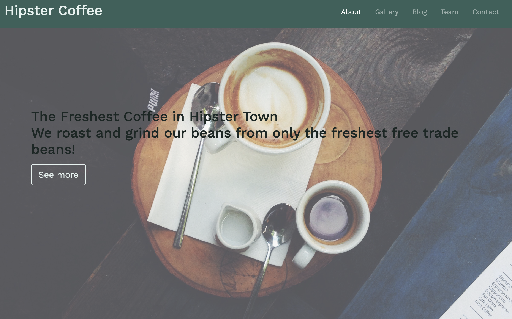

# Bootsrap Practice page

- This project was to create a single page website to utilize bootstrap. 
- This project was followed along from [freecodecamp](https://www.freecodecamp.org/learn/). 
- The purpose of this project was to learn the basics of Bootsrap.
- I built a tribute page for Diana Princess of Wales.

## Live project

- [View the live project here.](https://brianwhelandublin.github.io/bootstrap4-practice/)

## Screenshots

  - 

### Languages Used.

- [HTML5](https://en.wikipedia.org/wiki/HTML5)

  - HTML5 was used to create the content and base of each page.

- [CSS3](https://en.wikipedia.org/wiki/CSS)

  - CSS3 was used to then style the page and make it responsive through media queries, and interactive through using CSS transitions.

- [Bootstrap 4](https://getbootstrap.com/)

  - I used bootstrap throughout the site to make it responsive. I also used bootstrap to create the booking forms, and the modals pop up when the forms have been submitted.